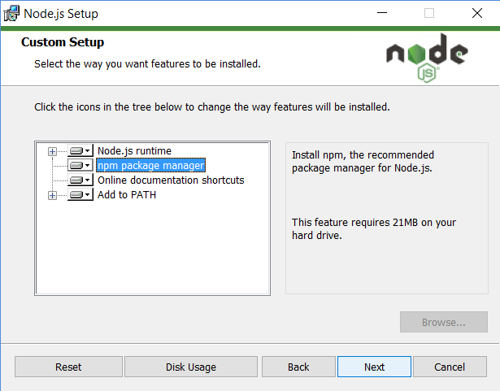

# Mi Proyecto de Angular

## INSTALACION

In order to use angular, we will need node.js, npm and angular cli. First we will need to install node.js, and we will select npm in the installation:



When it is installed, we will install angular cli with the following command:

```
npm install -g @angular/cli@16 
```

Here we are specifying that we want the version 16.

## Dependencies:

In order to use cookies in our website we will need the package "ngx-cookie-service". In order to install it we will need this command:

```
npm install ngx-cookie-service --save
```

## How to create a workspace.  

In the app PhpStorm execute (in the terminal): ng new [nombre_proyecto] 

This creates a new proyect of angular. 

It'll ask some questions after. Responses:

>N  
>Scss  
>N

## Workspace

Once we have installed and created a workspace, we will be able to start working. With angular cli we will be able to use a handful of commands. For example, the following comand, one of the most used, creates a component for angular.

>Ng g c [component_name] 

Here's a breakdown of the command: 

- ng: Stands for "Angular" and indicates you're using the Angular CLI. 

- g: Stands for "generate" and tells the CLI to generate something for your project. 

- c: Stands for "component" and specifies the type of thing you want to generate (a component in this case). 

- header: The name you're giving to the new component.

If you want to get help for more commands or even this one, you can use the command ```ng g --help``` and will see the help for all the commands you can use with angular cli.

```
ng g --help
```


# Documentación oficial

This project was generated with [Angular CLI](https://github.com/angular/angular-cli) version 16.2.14.

## Development server

Run `ng serve` for a dev server. Navigate to `http://localhost:4200/`. The application will automatically reload if you change any of the source files.

## Code scaffolding

Run `ng generate component component-name` to generate a new component. You can also use `ng generate directive|pipe|service|class|guard|interface|enum|module`.

## Build

Run `ng build` to build the project. The build artifacts will be stored in the `dist/` directory.

## Running unit tests

Run `ng test` to execute the unit tests via [Karma](https://karma-runner.github.io).

## Running end-to-end tests

Run `ng e2e` to execute the end-to-end tests via a platform of your choice. To use this command, you need to first add a package that implements end-to-end testing capabilities.

## Further help

To get more help on the Angular CLI use `ng help` or go check out the [Angular CLI Overview and Command Reference](https://angular.io/cli) page.
